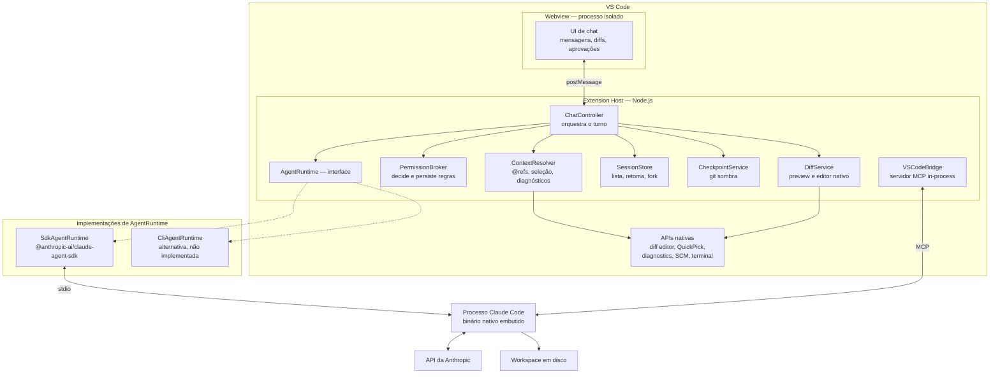
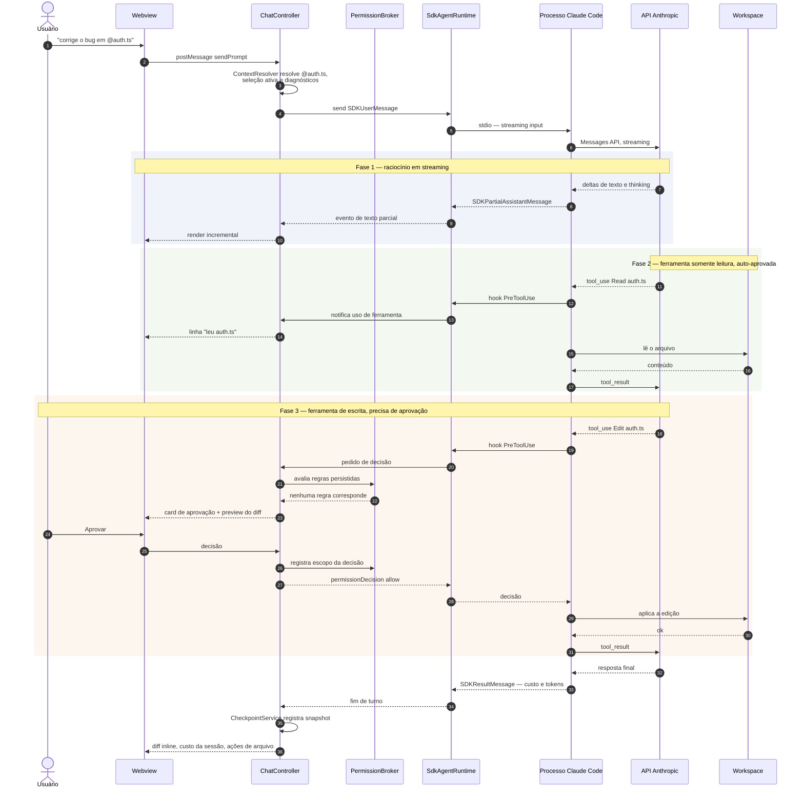

# Arquitetura

Status: proposta para revisão. Última revisão: 2026-09-19.

Três decisões estruturais foram fechadas em 2026-09-19 e este documento já as reflete:

- **Runtime:** o Claude Agent SDK como biblioteca, isolado atrás de uma interface `AgentRuntime` que mantém o wrapping do CLI viável sem reescrita ([#8](DECISIONS.md#8-sdk-como-biblioteca-ou-wrapping-do-cli)).
- **UI:** webview própria como superfície única; o chat participant está fora de escopo ([#9](DECISIONS.md#9-superfície-de-ui-webview-própria-ou-chat-participant-api)).
- **Auth:** reutilizar o login do Claude Code CLI via token OAuth no ambiente do processo filho, com API key como alternativa ([#4](DECISIONS.md#4-autenticação)).

---

## 1. Visão geral



Três fronteiras de processo importam:

| Fronteira | Comunicação | Consequência |
|---|---|---|
| Webview ↔ Extension Host | `postMessage`, assíncrono e serializável | A UI não tem acesso a `vscode.*` nem ao disco. Todo estado autoritativo vive no Extension Host. |
| Extension Host ↔ processo Claude Code | stdio, gerenciado pelo SDK | O SDK já faz o spawn, o protocolo e o backpressure. Não escrevemos parser de stream. |
| Processo Claude Code ↔ API | HTTPS direto | As credenciais do usuário nunca passam por servidor nosso. |

---

## 2. A decisão central e por que ela é menor do que parece

A pergunta "SDK como biblioteca ou orquestrar o CLI como processo filho?" sugere duas arquiteturas opostas. A documentação atual mostra que não são:

> "Both the TypeScript and Python SDKs bundle a native Claude Code binary, so most installs need no separate Claude Code install. (…) The TypeScript SDK installs its binary through npm optional dependencies"
> — [Agent SDK Quickstart](https://code.claude.com/docs/en/agent-sdk/quickstart)

Ou seja: **o SDK TypeScript já é um wrapper de processo filho.** Ele empacota o binário do Claude Code, faz o spawn e expõe um protocolo estruturado por cima. A opção `pathToClaudeCodeExecutable` permite inclusive apontar para um binário instalado separadamente.

Isso muda o enquadramento da decisão. Não é "biblioteca versus subprocesso" — é **"protocolo tipado e versionado versus parsing de stdout"**. Consequências:

- Os supostos ganhos do wrapping manual (herdar skills, plugins, marketplace de MCP, slash commands, `CLAUDE.md`) já vêm pelo SDK, porque é o mesmo binário rodando. `settingSources` controla quais níveis de configuração são carregados, e `"project"` é habilitado por padrão.
- O suposto custo do SDK (reimplementar em TypeScript o que só existe no CLI) é bem menor do que parece. O que efetivamente não está exposto programaticamente é um subconjunto de slash commands interativos e a UI de marketplace.
- O risco de "contrato de I/O que muda sem aviso" existe nos dois caminhos, mas no SDK ele é tipado, versionado em npm e documentado com CHANGELOG.

**Decisão:** `SdkAgentRuntime` como implementação padrão. A interface `AgentRuntime` existe mesmo assim — não como hedge teórico, mas porque torna o runtime mockável em testes e porque uma implementação CLI pode virar necessidade se aparecer um recurso exclusivo do CLI que valha a pena.

```typescript
// Esboço — a superfície real será derivada dos tipos do SDK, não redefinida à mão.
interface AgentRuntime {
  start(config: RuntimeConfig): Promise<RuntimeSession>;
}

interface RuntimeSession {
  send(message: UserTurn): void;          // enfileira; não bloqueia
  events(): AsyncIterable<RuntimeEvent>;  // texto, thinking, tool_use, result, custo
  interrupt(): Promise<void>;
  setPermissionMode(mode: PermissionMode): Promise<void>;
  setModel(model: string): Promise<void>;
  dispose(): Promise<void>;
}
```

> **Regra de implementação:** não redefinir tipos que o SDK já exporta (`SDKUserMessage`, `SDKAssistantMessage`, `SDKResultMessage`, `PermissionResult`, `HookCallback`). `RuntimeEvent` é uma *união discriminada de eventos de UI*, derivada dos tipos do SDK — não uma cópia deles.

---

## 3. O que o Agent SDK entrega

Confirmado na [referência TypeScript](https://code.claude.com/docs/en/agent-sdk/typescript) (setembro de 2026):

| Necessidade do produto | O que o SDK oferece |
|---|---|
| Loop do agente | `query({ prompt, options })` → `Query extends AsyncGenerator<SDKMessage, void>` |
| Sessão interativa multi-turno | **Streaming input mode**: `prompt` como `AsyncIterable<SDKUserMessage>` |
| Streaming token a token | `includePartialMessages: true` → `SDKPartialAssistantMessage` |
| Ferramentas de código | Read, Write, Edit, Bash, Glob, Grep, WebSearch, WebFetch nativas |
| Aprovação interativa | callback `canUseTool` → `PermissionResult` |
| Interceptação universal | `hooks` — `PreToolUse`, `PostToolUse`, `PostToolUseFailure`, `UserPromptSubmit`, `SessionStart`, `SessionEnd`, `Stop`, `SubagentStart`, `SubagentStop`, `PreCompact`, `PermissionRequest`, `Notification` |
| Modo Plan | `permissionMode: 'plan'` |
| Níveis de raciocínio | `effort: 'low' \| 'medium' \| 'high' \| 'xhigh' \| 'max'` |
| Sessões | `resume`, `resumeSessionAt`, `forkSession`, `listSessions()`, `getSessionMessages()`, `renameSession()`, `tagSession()` |
| Subagentes | `agents: Record<string, AgentDefinition>` |
| MCP | `mcpServers` com transportes stdio / http / sse / in-process |
| Ferramentas próprias | `createSdkMcpServer()` + `tool()` — servidor MCP no nosso processo |
| Custo | `SDKResultMessage.total_cost_usd`, `maxBudgetUsd` |
| Interrupção | `AbortController` via `options.abortController` |
| Controle em tempo real | `setPermissionMode()`, `setModel()` sobre a query ativa |
| Latência de ativação | `startup()` pré-aquece o subprocesso antes do primeiro prompt |
| Configuração do projeto | `settingSources` — carrega `CLAUDE.md`, `.claude/settings.json`, `.mcp.json` |

**O que o SDK não resolve, e é trabalho nosso:** toda a UI, a ponte de contexto do editor, a persistência de regras de permissão em formato editável, checkpoints, resolução de `@`-referências, apresentação de diffs e o ciclo de vida da extensão.

**Streaming input mode é obrigatório para este produto.** O modo de mensagem única não suporta anexo de imagem, enfileiramento de mensagens, interrupção em tempo real nem troca de modo no meio da sessão — os quatro são requisitos do MVP.

---

## 4. Superfícies de UI: o que o VS Code realmente oferece

Esta seção existe porque a resposta é menos óbvia do que a documentação sugere à primeira leitura.

### 4.1 APIs relevantes e seu status

| API | Status | Serve para nós? |
|---|---|---|
| **Webview API** (`createWebviewPanel`, `WebviewViewProvider`) | Finalizada, sem restrições | ✅ Controle total da UI. Caminho do `claude-code-chat`, do Cline e do Roo Code. |
| **Chat Participant API** (`vscode.chat.createChatParticipant`, contribuição `chatParticipants`) | Finalizada | ⚠️ Registra `@nosso-agente` na view nativa. Duas limitações documentadas: precisa ser @-mencionado e **não pode ser o participante padrão**. Ver 4.2. |
| **Language Model Tool API** (`vscode.lm.registerTool`, contribuição `languageModelTools`, `vscode.lm.tools`) | Finalizada | ⚠️ Duas direções — ver 4.3. |
| **Language Model Chat Provider API** (contribuição `languageModelChatProviders`) | Finalizada em 1.104 | ❌ Ver 4.4. |
| **Chat Sessions Provider** (`registerChatSessionItemProvider` / `createChatSessionItemController`) | **Proposta**, em evolução | ❌ APIs propostas não podem ser publicadas no Marketplace, salvo extensões explicitamente autorizadas no `product.json` do VS Code. |
| `chatParticipantPrivate`, `chatDebug` | Propostas, de uso interno | ❌ Mesmo motivo. |

### 4.2 Chat Participant API — descartada em 2026-09-19

> **Decisão:** a webview própria é a **superfície única**. O chat participant está fora de escopo. Ver [DECISIONS #9](DECISIONS.md#9-superfície-de-ui-webview-própria-ou-chat-participant-api). O restante desta seção registra por quê.

A Chat Participant API é finalizada e tecnicamente utilizável por terceiros. O problema é outro: **não ficou confirmado se a view de chat nativa é utilizável sem um plano GitHub Copilot.**

Os sinais são contraditórios:

- A documentação da API recomenda *não* declarar dependência de extensão no Copilot — o que sugere que chat participants não deveriam exigi-lo.
- O FAQ de agentes do VS Code afirma que o uso de chat exige entrar com uma conta com plano Copilot **ou** configurar um modelo bring-your-own-key.
- As notas da 1.104 dizem, sobre modelos contribuídos por extensão: *"Models provided through this API are currently only available to users on individual GitHub Copilot plans."* — texto de setembro de 2025, possivelmente desatualizado, já que o BYOK evoluiu desde então.

**Nenhuma dessas fontes responde diretamente à pergunta que importa:** um chat participant de terceiro, que usa seu próprio backend e não toca `vscode.lm`, funciona numa instalação limpa do VS Code sem conta GitHub?

Isso é exatamente o requisito número um do projeto, e **não pode ser assumido**.

**Decisão de arquitetura (2026-09-19):** a **webview própria é a superfície única**. Em vez de esperar o spike S1 e condicionar a arquitetura à resposta dele, a incerteza foi removida por escolha — o produto não depende de uma política de terceiro. O spike S1 continua no roadmap com prioridade baixa, como informação, e não decide mais nada.

Se um dia o chat participant entrar como superfície *adicional*, a `ChatController` é o ponto de extensão: `ChatResponseStream` (`markdown`, `progress`, `anchor`, `button`, `filetree`, `reference`) é um subconjunto do que a webview renderiza. Não é um objetivo.

Custo dessa escolha: perdemos de graça o histórico nativo, o seletor de modelo nativo e o gerenciamento de sessões da view de chat — tudo isso vira implementação nossa, junto com paridade de tema e acessibilidade. É o preço da independência do Copilot, foi contabilizado e agora é definitivo.

### 4.3 Language Model Tool API — duas direções

**Direção A — nós contribuímos ferramentas para o agent mode do Copilot.** Não é o objetivo do projeto, mas é barato: declarar `languageModelTools` no `package.json` e registrar via `vscode.lm.registerTool`. Fica para depois da v1, se fizer sentido.

**Direção B — nós consumimos as ferramentas de outras extensões.** Esta é a interessante. `vscode.lm.tools` lista as ferramentas contribuídas por todas as extensões instaladas. Expô-las ao Claude através do `VSCodeBridge` (servidor MCP in-process) daria ao agente acesso ao ecossistema de extensões do VS Code — algo que nem o CLI nem a extensão oficial têm.

**Bloqueador para verificar:** `vscode.lm.invokeTool` recebe um `toolInvocationToken` que, na documentação, está associado ao contexto de uma requisição de chat. Não foi confirmado se a invocação fora desse contexto é permitida. Spike S3.

### 4.4 Language Model Chat Provider API — por que não

Poderíamos registrar Claude como provedor de modelo e deixar o usuário selecioná-lo na view de chat nativa. Isso entrega paridade de UI quase de graça — e entrega o harness errado: o loop do agente passaria a ser o do Copilot Chat, que é precisamente o problema que motivou o projeto. Somado à restrição de plano Copilot citada acima, está descartado.

---

## 5. Componentes do Extension Host

| Componente | Responsabilidade | Não é responsável por |
|---|---|---|
| `ExtensionActivator` | Ativação preguiçosa, registro de comandos e views, `startup()` do SDK em background | Lógica de negócio |
| `ChatController` | Orquestra um turno: monta o `SDKUserMessage`, consome os eventos do runtime, emite atualizações para a UI | Falar com a API |
| `ContextResolver` | Resolve `@arquivo`, seleção ativa, abas abertas, diagnósticos, imagens coladas → blocos de conteúdo | Decidir o que é relevante — isso é do modelo |
| `PermissionBroker` | Recebe pedidos de permissão, consulta regras persistidas, pede decisão ao usuário, grava "always allow" | Aplicar a decisão — quem aplica é o harness |
| `DiffService` | Materializa `Edit`/`Write` como preview, renderiza diff inline, abre no diff nativo, aceita/rejeita por arquivo | Escrever em disco — quem escreve é o harness |
| `SessionStore` | Lista, retoma, faz fork, renomeia sessões; mapeia sessões ↔ workspace | Persistir mensagens — o SDK já persiste |
| `CheckpointService` | Snapshot em repositório git sombra antes de cada turno que escreve; restauração | Tocar no `.git` do usuário |
| `VSCodeBridge` | Servidor MCP in-process que expõe capacidades do editor ao agente | Ser um servidor MCP externo |
| `AgentRuntime` | Única fronteira com o SDK | Qualquer decisão de produto |
| `TelemetryGate` | Ponto único de saída de qualquer dado; desligado por padrão | — |

**Invariante:** nenhum componente fora do `AgentRuntime` importa `@anthropic-ai/claude-agent-sdk` diretamente. Isso é verificável com uma regra de lint e é o que mantém a troca de runtime barata.

---

## 6. Fluxo de uma mensagem, do usuário à resposta

Cenário: o usuário pede uma alteração, o modelo lê um arquivo, chama `Edit`, o usuário aprova, e a resposta final chega.



Quatro pontos que o diagrama torna explícitos:

1. **Os hooks rodam no nosso processo.** Registrados via `options.hooks`, eles são callbacks TypeScript; o SDK transporta o evento pelo stdio e traz a decisão de volta. Não são scripts de shell.
2. **A decisão de permissão é nossa, a execução é do harness.** Devolvemos `permissionDecision: 'allow' | 'deny' | 'ask' | 'defer'`; quem aplica a edição é o processo Claude Code, com toda a lógica de edição de arquivo que já foi testada em produção.
3. **O ciclo de aprovação é assíncrono e pode demorar.** O harness fica bloqueado esperando. Precisa haver timeout, cancelamento e reentrada limpa se a janela do VS Code perder o foco ou a sessão for encerrada.
4. **Ferramentas de leitura não param o fluxo, mas aparecem.** O objetivo é observabilidade, não fricção.

---

## 7. Permissões e observabilidade de ferramentas

O SDK avalia permissões em seis etapas, nesta ordem:

```
hooks → regras deny → regras ask → permission mode → regras allow → canUseTool
```

Disso decorre uma armadilha que a documentação sinaliza de forma enfática e que define nossa implementação:

> **"Auto-approved tools never reach `canUseTool`.** A tool call approved at any earlier step, by `acceptEdits` or `bypassPermissions`, or by an allow rule, skips your `canUseTool` callback (…) For checks that must run on every tool call, use a `PreToolUse` hook: hooks run before every other step."
> — [Agent SDK — Permissions](https://code.claude.com/docs/en/agent-sdk/permissions)

O princípio "nenhuma ação invisível" de [VISION.md](VISION.md#6-princípios-de-design) exige ver *toda* chamada de ferramenta, inclusive as pré-aprovadas e as executadas em modo autônomo. Portanto:

**Regra de arquitetura:** a observabilidade vem de um hook `PreToolUse` sem matcher, registrado sempre. O `canUseTool` fica responsável apenas pelo diálogo de aprovação quando nenhuma etapa anterior resolveu o caso.

```
PreToolUse (sempre)  →  registra na UI, alimenta o log de auditoria, aplica deny local
canUseTool           →  UI de aprovação interativa
```

Há uma segunda razão prática: o SDK emite um warning de processo com código `CLAUDE_SDK_CAN_USE_TOOL_SHADOWED` quando um `canUseTool` é passado em configuração onde ele nunca seria consultado. Tratar isso como sinal de bug de configuração, não como ruído a silenciar.

### Mapeamento modo de UI → configuração do SDK

| Modo na UI | Configuração | Comportamento |
|---|---|---|
| **Perguntar sempre** (padrão) | `permissionMode: 'default'` | Toda ação que precisa de aprovação abre um card |
| **Aceitar edições** | `permissionMode: 'acceptEdits'` | Edições de arquivo no workspace passam direto; shell e MCP ainda perguntam |
| **Planejar primeiro** | `permissionMode: 'plan'` | Explora e propõe sem editar; edições nunca são auto-aprovadas |
| **Autônomo** | `permissionMode: 'bypassPermissions'` | Exige confirmação explícita ao ativar, indicador visual permanente, volta a `default` no fim da sessão |
| **Somente leitura** | `permissionMode: 'dontAsk'` + `allowedTools: ['Read','Glob','Grep']` | Nada que precisaria de aprovação roda — nega em vez de perguntar |

Regras "always allow" são gravadas em `.claude/settings.json` (escopo projeto) ou nas settings de usuário, no **mesmo formato que o CLI lê** — `Bash(npm run test:*)`, `Edit(src/**)`. Uma regra criada na extensão vale no terminal, e vice-versa. Isso é consequência direta do princípio "configuração é do repositório".

> **Atenção:** `allowedTools` **não** restringe `bypassPermissions`. Listar `['Read']` junto com `bypassPermissions` aprova tudo, inclusive `Bash` e `Write`. Para bloquear de verdade, usar `disallowedTools`.

---

## 8. Ponte de contexto: o `VSCodeBridge`

Servidor MCP in-process criado com `createSdkMcpServer()` e registrado em `options.mcpServers`. Roda no Extension Host, com acesso completo a `vscode.*`. As ferramentas ficam nomeadas `mcp__vscode__<tool>` e são pré-aprovadas com `allowedTools: ['mcp__vscode__*']`, já que são de leitura.

| Ferramenta proposta | O que expõe | Prio |
|---|---|---|
| `get_diagnostics` | Erros e avisos do language server, por arquivo ou do workspace | v0.1 |
| `get_editor_state` | Arquivo ativo, seleção, abas abertas, breakpoints | v0.1 |
| `get_workspace_info` | Pastas do workspace, branch git, arquivos com mudanças não commitadas | v0.2 |
| `run_vscode_command` | Executa um comando do VS Code de uma allowlist | v0.2 |
| `invoke_lm_tool` | Ponte para `vscode.lm.tools` — ferramentas de outras extensões | pendente do spike S3 |

Por que MCP e não injetar o contexto no prompt: o agente **puxa** o que precisa, quando precisa, em vez de recebermos tudo empurrado em todo turno. Economiza contexto e coloca a decisão de relevância onde ela funciona melhor.

Custo a monitorar: servidores MCP in-process atrasam o primeiro turno até conectarem e listarem ferramentas. Com poucas ferramentas o impacto é pequeno, mas `startup()` no momento da ativação da extensão absorve boa parte dele.

---

## 9. Ambientes remotos e WSL

> ✅ **Decisão em 2026-09-19 — opção A** ([DECISIONS #6](DECISIONS.md#6-remote-development-no-mvp)): `extensionKind: workspace` + detectar e orientar o caso de travessia de fronteira. É o que esta seção já descreve.

O harness precisa de um processo Node com acesso ao mesmo sistema de arquivos do workspace. Isso define tudo aqui.

**Caso bom — Extension Host remoto.** Em WSL Remote, Remote-SSH e Dev Containers, o VS Code roda o Extension Host *dentro* do ambiente remoto. Nossa extensão roda lá, o binário do Claude Code roda lá, o workspace está lá. Não há cruzamento de sistemas de arquivos e o problema simplesmente não existe. **Requisito:** declarar `extensionKind: ["workspace"]` no `package.json`, forçando a execução no lado remoto.

**Caso ruim — cruzar a fronteira.** É o que o `claude-code-chat` resolve com `claudeCodeChat.wsl.enabled`, `.wsl.distro`, `.wsl.nodePath` e `.wsl.claudePath`: VS Code rodando no Windows, projeto dentro do WSL, invocando o binário via `wsl.exe`. Isso exige tradução de caminhos nos dois sentidos, lida com credenciais que vivem no home do Linux e é exatamente o tipo de código frágil que causa bugs difíceis.

**Decisão:** não implementar a travessia de fronteira. Detectar a situação e orientar o usuário a reabrir a pasta em WSL Remote — um comando, resolve de verdade, e resolve também o problema conhecido de credenciais do Claude Code presas dentro do WSL. Reavaliar depois da v1 se houver demanda real.

| Ambiente | Estratégia | Versão |
|---|---|---|
| Windows / macOS / Linux nativos | Direto | v0.1 |
| WSL via "Reopen in WSL" | Extension Host remoto, transparente | v0.1 |
| VS Code no Windows + projeto no WSL | Detectar e orientar a reabrir em WSL Remote | v0.1 |
| Remote-SSH, Dev Containers | `extensionKind: workspace`, validar binário no destino | v0.2 |
| Codespaces web, vscode.dev | Não suportado — sem processo local | — |

---

## 10. Empacotamento e distribuição do binário

O SDK TypeScript traz o binário nativo do Claude Code por **optional dependencies** do npm. Isso tem três consequências diretas para uma extensão:

1. **Bundlers quebram isso.** esbuild/webpack empacotam o JS mas não resolvem dependências opcionais nativas. O `.vsix` precisa carregar os artefatos, ou a extensão precisa localizar um binário instalado e apontar `pathToClaudeCodeExecutable` para ele.
2. **VSIX por plataforma.** `vsce package --target win32-x64 | darwin-arm64 | linux-x64 | …` produz pacotes específicos, suportado desde o VS Code 1.61. Evita embarcar cinco binários em todo download.
3. **`npm ci --omit=optional` no CI produz um pacote quebrado** — silenciosamente, porque só falha em runtime. Precisa de verificação explícita no pipeline.

**Estratégia proposta:** VSIX por plataforma com o binário embutido, e fallback para um binário do sistema quando o embutido estiver ausente, com mensagem de erro que diga o que fazer. Decidido como spike S2 antes do scaffold, porque muda a configuração de build.

---

## 11. Estado e persistência

| Dado | Onde vive | Por quê |
|---|---|---|
| Mensagens e transcrição | Armazenamento de sessões do SDK | Compatível com o CLI — a mesma sessão continua no terminal |
| Índice sessão ↔ workspace | `ExtensionContext.workspaceState` | Barato, escopado ao workspace |
| Regras de permissão | `.claude/settings.json` ou settings de usuário | Formato do CLI, versionável, editável à mão |
| Credencial (token OAuth do CLI ou API key) | `ExtensionContext.secrets` (`SecretStorage`) | Nunca em `settings.json`, nunca no `workspaceState`. Chega ao processo filho pelo ambiente, não por arquivo |
| Preferências de UI | Settings do VS Code | Sincronizáveis via Settings Sync |
| Checkpoints | Repositório git sombra em `globalStorageUri` | Fora do `.git` do usuário — não polui histórico, index nem hooks |
| Rascunho do prompt | `workspaceState` | Sobrevive a recarregar a janela |

**Checkpoints.** Antes de cada turno que pode escrever, snapshot do estado atual dos arquivos rastreados num repositório git separado, com o id do turno como mensagem de commit. Restaurar é um checkout desse repositório sobre o workspace. Conceito emprestado do `claude-code-chat` — que está sob licença "Other / NOASSERTION", então serve como referência conceitual e não como origem de código.

---

## 12. Erros e degradação

Cada linha aqui é um requisito de implementação, não uma boa intenção.

| Falha | Comportamento |
|---|---|
| Sem credencial nenhuma | Estado vazio na UI com duas ações — "usar meu login do Claude Code" e "colar uma API key"; a extensão ativa normalmente |
| Token OAuth expirado no meio de um turno | Erro nomeando a expiração, com ação para renovar; a transcrição é preservada e o turno é retomável. **Não** cair silenciosamente para outra credencial |
| Binário do Claude Code ausente | Erro nomeando o caminho procurado + ação para instalar ou apontar o caminho |
| Processo do harness morre no meio do turno | Marca o turno como interrompido, preserva a transcrição, oferece retomar a sessão |
| Servidor MCP não conecta | Continua sem ele, indica status `failed`/`needs-auth` na UI; não trava o turno |
| Rate limit / erro de API | Mostra o erro do provedor literalmente, sem reinterpretar |
| Usuário fecha a janela com aprovação pendente | Trata como negação, encerra a query pelo `AbortController` |
| Workspace sem pasta aberta | Chat funciona sem ferramentas de arquivo; explica a limitação |
| `maxBudgetUsd` atingido | Para, informa o gasto, oferece elevar o teto |

---

## 13. Estrutura de pastas proposta

```
src/
  extension.ts              # ativação, registro de comandos e views
  runtime/
    AgentRuntime.ts         # interface + tipos de evento
    SdkAgentRuntime.ts      # ÚNICO arquivo que importa o SDK
    hooks/                  # PreToolUse (observabilidade), PostToolUse (auditoria)
  chat/
    ChatController.ts
    ContextResolver.ts
    SlashCommands.ts
  permissions/
    PermissionBroker.ts
    RuleStore.ts            # leitura/escrita de .claude/settings.json
  diff/
    DiffService.ts
  sessions/
    SessionStore.ts
  checkpoints/
    CheckpointService.ts
  bridge/
    VSCodeBridge.ts         # servidor MCP in-process
    tools/
  webview/
    index.html
    src/                    # app da UI — sem import de 'vscode'
  telemetry/
    TelemetryGate.ts
test/
  contract/                 # testes contra versão fixada do SDK
  integration/
docs/
```

---

## 14. Spikes que precisam acontecer antes do scaffold

Listados aqui e priorizados em [ROADMAP.md](ROADMAP.md#v00--spikes-de-validação).

| # | Pergunta | Por que bloqueia |
|---|---|---|
| ~~**S1**~~ | ~~Um chat participant de terceiro funciona em VS Code limpo, sem conta GitHub?~~ | **Não bloqueia mais** — a webview é a superfície única por decisão ([#9](DECISIONS.md#9-superfície-de-ui-webview-própria-ou-chat-participant-api)) |
| **S2** | Um `.vsix` com o binário nativo do SDK instala, roda **e autentica com o token do CLI** nas três plataformas? | Define a configuração de build, o pipeline de release e o caminho de auth ([#4](DECISIONS.md#4-autenticação)) |
| **S3** | `vscode.lm.invokeTool` pode ser chamada fora do contexto de uma requisição de chat? | Define se a ponte para ferramentas de outras extensões existe |
| **S4** | O ciclo `PreToolUse` → UI → decisão aguenta uma sessão longa sem travar? | É o caminho crítico do produto inteiro |
| **S5** | Sessões criadas pela extensão são retomáveis pelo `claude` no terminal, e vice-versa? | É o critério de sucesso número um em [VISION.md](VISION.md#7-como-saber-se-deu-certo) |

---

## Fontes

Documentação consultada em 2026-09-18. Este espaço muda rápido; reconferir antes de decisões irreversíveis.

- Agent SDK: [visão geral](https://code.claude.com/docs/en/agent-sdk/overview) · [quickstart](https://code.claude.com/docs/en/agent-sdk/quickstart) · [referência TypeScript](https://code.claude.com/docs/en/agent-sdk/typescript) · [permissões](https://code.claude.com/docs/en/agent-sdk/permissions) · [hooks](https://code.claude.com/docs/en/agent-sdk/hooks) · [MCP](https://code.claude.com/docs/en/agent-sdk/mcp) · [streaming input](https://code.claude.com/docs/en/agent-sdk/streaming-vs-single-mode)
- VS Code: [Chat Participant API](https://code.visualstudio.com/api/extension-guides/ai/chat) · [Language Model Tool API](https://code.visualstudio.com/api/extension-guides/ai/tools) · [notas da 1.104](https://code.visualstudio.com/updates/v1_104) · [usar APIs propostas](https://code.visualstudio.com/api/advanced-topics/using-proposed-api) · [publicação e VSIX por plataforma](https://code.visualstudio.com/api/working-with-extensions/publishing-extension)
- Referências de terceiros: [andrepimenta/claude-code-chat](https://github.com/andrepimenta/claude-code-chat) · [cline/cline](https://github.com/cline/cline)
