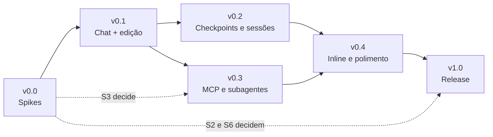

# Roadmap

Fases propostas, com critério de saída explícito para cada uma. Sem datas: o projeto ainda não começou e estimativa neste ponto seria ficção. Onde há esforço indicado, é ordem de grandeza para dimensionar escopo, não compromisso.

Última revisão: 2026-09-19.

**Regra que atravessa todas as fases:** uma fase só termina quando seu critério de saída é verificável por alguém que não escreveu o código.

---

## v0.0 — Spikes de validação

**Objetivo:** matar as incertezas que podem invalidar o plano, antes de escrever código que dependa delas. Código descartável, em repositório separado ou numa branch de spike.

| Spike | Pergunta | Como validar | Decide |
|---|---|---|---|
| ~~**S1**~~ | ~~Um chat participant de terceiro funciona em VS Code limpo, sem conta GitHub?~~ | — | **Não bloqueia mais.** A [questão 9](DECISIONS.md#9-superfície-de-ui-webview-própria-ou-chat-participant-api) foi decidida pela webview própria como superfície única. Rodar o spike virou opcional, prioridade baixa, e não decide nada — **✅ confirmado em Windows 2026-09-20** (funciona, mas exige marcar a pasta como confiável). Ver [spikes/s1-chat-participant/FINDINGS.md](../spikes/s1-chat-participant/FINDINGS.md) |
| **S2** | Um `.vsix` com o binário nativo do SDK instala e roda em Windows, macOS e Linux? | `vsce package --target` para as três plataformas; instalar cada um numa máquina limpa; rodar um turno com uma ferramenta | [Questão 8](DECISIONS.md#8-sdk-como-biblioteca-ou-wrapping-do-cli) e [ARCHITECTURE § 10](ARCHITECTURE.md#10-empacotamento-e-distribuição-do-binário) — **✅ Linux confirmado 2026-09-20, Windows/macOS pendentes.** Ver [spikes/s2-vsix-packaging/FINDINGS.md](../spikes/s2-vsix-packaging/FINDINGS.md) |
| **S6** | O binário embutido no `.vsix` autentica com a credencial do Claude Code CLI do usuário? | Descobrir qual opção do `query` controla o ambiente do processo filho; passar `CLAUDE_CODE_OAUTH_TOKEN` por ela e rodar um turno **sem** `ANTHROPIC_API_KEY` no ambiente, nas três plataformas | Viabilidade da [questão 4](DECISIONS.md#4-autenticação); roda junto com o S2 — **✅ Confirmado em Linux 2026-09-20:** é `options.env` de `query()` (substitui o ambiente inteiro, não faz merge). Ver [FINDINGS.md](../spikes/s2-vsix-packaging/FINDINGS.md) |
| **S3** | `vscode.lm.invokeTool` pode ser chamada fora do contexto de uma requisição de chat? | Extensão mínima que lista `vscode.lm.tools` e tenta invocar uma sem `toolInvocationToken` de chat | Se o `VSCodeBridge` expõe ferramentas de outras extensões |
| **S4** | O ciclo `PreToolUse` → UI → decisão do usuário aguenta uma sessão longa? | Sessão de 30+ minutos, ~50 chamadas de ferramenta, aprovações com atraso proposital de 2 a 60 s; verificar vazamento de handler, timeout e cancelamento | Viabilidade do caminho crítico |
| **S5** | Sessões criadas pela extensão são retomáveis pelo `claude` no terminal, e vice-versa? | Criar sessão pelo SDK, abrir `claude --resume`; depois o inverso | O critério de sucesso nº 1 de [VISION](VISION.md#7-como-saber-se-deu-certo) |

**Já decidido, fora desta fase:** as três questões 🔴 — [SDK como biblioteca](DECISIONS.md#8-sdk-como-biblioteca-ou-wrapping-do-cli), [webview própria](DECISIONS.md#9-superfície-de-ui-webview-própria-ou-chat-participant-api) e [reutilizar o login do CLI](DECISIONS.md#4-autenticação) — e também o [nome do projeto](DECISIONS.md#1-nome-do-projeto) (**Claude Coding Agent**) e a [licença](DECISIONS.md#2-licença-e-modelo-de-abertura) (**Apache 2.0**, aberto desde o primeiro commit). Nada mais trava o primeiro commit de código.

**Critério de saída:** S2, S3, S4, S5 e S6 respondidos por escrito, com evidência reproduzível. O S1 não é critério de saída.

---

## v0.1 — MVP: chat + edição com aprovação

**Objetivo:** provar a tese inteira ponta a ponta. Um turno completo — prompt, contexto do editor, ferramentas, aprovação, diff, resposta — funcionando bem o bastante para uso diário do autor.

**Não é** um release público. É um `.vsix` instalável, entregue a poucas pessoas.

### Escopo

**Infraestrutura**
- Scaffold: `package.json`, TypeScript, esbuild, empacotamento com binário nativo
- `AgentRuntime` + `SdkAgentRuntime` em streaming input mode
- `startup()` na ativação para absorver a latência do primeiro prompt
- Regra de lint: só `SdkAgentRuntime.ts` importa `@anthropic-ai/claude-agent-sdk`

**Chat**
- Webview com streaming, tema nativo, markdown com syntax highlight, copiar bloco
- Enviar, interromper, enfileirar mensagens
- Rascunho preservado ao recarregar a janela
- Transcrição persistida por workspace, com compactação automática do harness

**Contexto**
- `@arquivo` com quick-pick sobre o workspace
- Seleção ativa do editor enviada como contexto
- `VSCodeBridge` com `get_diagnostics` e `get_editor_state`
- `CLAUDE.md` e `.claude/settings.json` do projeto carregados

**Ferramentas e permissões**
- Ferramentas nativas: Read, Write, Edit, Bash, Glob, Grep
- Hook `PreToolUse` sem matcher — toda chamada aparece na UI, inclusive as pré-aprovadas
- `canUseTool` para o card de aprovação, com preview do comando ou do diff
- "Always allow" persistido em `.claude/settings.json`, formato do CLI
- Modos: Perguntar sempre, Aceitar edições, Somente leitura
- Escritas confinadas ao workspace

**Diffs**
- Diff inline na mensagem, truncado com expandir
- Abrir no editor de diff nativo com um clique
- Lista de arquivos alterados no turno

**Modelo e conta**
- Seletor de modelo Claude
- Detectar o login do Claude Code CLI e oferecer reutilizá-lo; API key como caminho alternativo
- Credencial em `SecretStorage`; onboarding que mostra qual credencial está em uso e de onde veio
- Custo e tokens do turno e da sessão na UI

**Ambientes**
- `extensionKind: ["workspace"]`
- Detectar "VS Code no Windows + projeto no WSL" e orientar a reabrir em WSL Remote

### Fora do escopo desta fase

Chat inline, checkpoints, MCP externo, subagentes, modo Plan na UI, múltiplas sessões simultâneas, fork de sessão, colar imagem, slash commands, modo autônomo.

### Critério de saída

1. O autor usa a extensão por uma semana sem abrir o terminal para tarefas de agente
2. Uma tarefa que o `claude` resolve no CLI resolve igual na extensão, com o mesmo `CLAUDE.md`
3. Nenhuma chamada de ferramenta acontece sem aparecer na UI
4. Instalação em menos de 2 minutos para quem já usa o Claude Code CLI — sem colar credencial nenhuma
5. Nenhum ponto do fluxo pede conta GitHub

---

## v0.2 — Confiança: reverter, revisar, retomar

**Objetivo:** tornar seguro deixar o agente trabalhar. O MVP prova que funciona; esta fase torna aceitável errar.

### Escopo

**Checkpoints**
- Repositório git sombra em `globalStorageUri`, snapshot antes de cada turno que escreve
- Restauração com um clique, com diff do que será revertido
- Sem tocar no `.git`, no index nem nos hooks do usuário

**Revisão**
- Aceitar/rejeitar por arquivo dentro do turno
- Navegação entre arquivos alterados
- Marcação visual de arquivos tocados na árvore de explorador

**Sessões**
- Lista navegável de sessões do workspace
- Retomar (`resume`), renomear, marcar com tag
- Várias sessões persistidas, uma ativa por vez

**Modos**
- Modo Plan na UI (`permissionMode: 'plan'`), com o plano renderizado e aprovável
- Níveis de raciocínio via `effort`
- Modo autônomo (`bypassPermissions`) com confirmação explícita, indicador permanente e retorno automático a `default` no fim da sessão
- Teto de gasto por sessão (`maxBudgetUsd`)

**Robustez**
- Todos os cenários de [ARCHITECTURE § 12](ARCHITECTURE.md#12-erros-e-degradação) implementados e testados
- Log de auditoria local via `PostToolUse`
- Comando "Exportar log de diagnóstico", redigido

**Ambientes**
- Remote-SSH e Dev Containers validados

### Critério de saída

Uma sessão autônoma que faça algo errado pode ser totalmente revertida em menos de 10 segundos, sem perda de trabalho não relacionado.

---

## v0.3 — Extensibilidade

**Objetivo:** sair da paridade com o CLI e começar a explorar o que só faz sentido dentro de um editor.

### Escopo

- Servidores MCP externos: stdio, http e sse, lidos de `.mcp.json` e das settings
- Status e reconexão de servidores MCP visíveis na UI
- Subagentes via `options.agents`, com progresso aninhado na transcrição
- Slash commands — subconjunto que faz sentido numa GUI
- Colar imagem com preview; arrastar arquivo ou pasta para o chat
- Hooks do usuário expostos como ponto de extensão documentado
- `VSCodeBridge`: `get_workspace_info`, `run_vscode_command` com allowlist
- `invoke_lm_tool`, se o spike S3 tiver sido favorável
- Bedrock, Vertex e Foundry como métodos de autenticação

### Critério de saída

Um servidor MCP de terceiro configurado no `.mcp.json` do projeto funciona igual no CLI e na extensão, sem configuração duplicada.

---

## v0.4 — Chat inline e polimento

**Objetivo:** fechar a lacuna de UX que sobrou em relação ao Copilot Chat e deixar apresentável para estranhos.

### Escopo

- Chat inline no editor: disparo por atalho e `CodeAction`, edição aplicada via `WorkspaceEdit` com diff nativo
- Aceitar/rejeitar por hunk
- Fork de sessão a partir de um ponto (`forkSession` + `resumeSessionAt`)
- Aviso visual de compactação de contexto (`PreCompact`)
- Acessibilidade: navegação por teclado, leitores de tela, contraste
- Documentação de usuário, primeira execução, mensagens de erro revisadas

### Critério de saída

Uma pessoa que nunca viu o projeto instala, configura e completa uma tarefa real sem perguntar nada a ninguém.

---

## v1.0 — Release público

**Objetivo:** publicar.

### Escopo

- Publicação no Marketplace e no Open VSX, VSIX por plataforma, pelo mesmo job de CI
- Ícone, README do Marketplace, capturas de tela, changelog
- Política de privacidade e página de segurança
- Revisão de licenças de todas as dependências
- Revisão de segurança: manipulação de segredos, injeção em comandos de shell, conteúdo da webview, CSP
- Suíte de testes de contrato contra versão fixada do SDK, rodando no CI
- Processo de issues, template de bug e política de suporte

### Critério de saída

Instalável pelo Marketplace, funcionando em Windows, macOS e Linux, sem nenhum requisito de conta GitHub em nenhum ponto.

---

## Depois da v1 — candidatos, não compromissos

Registrado para não se perder, sem ordem de prioridade:

- **Multi-provider** — ver [Questão 7](DECISIONS.md#7-só-claude-ou-multi-provider). Implica um segundo runtime completo.
- **Travessia de fronteira WSL** sem Remote — ver [Questão 6](DECISIONS.md#6-remote-development-no-mvp). Só com demanda concreta.
- **Marketplace de MCP e skills** dentro da UI
- **Contribuir nossas ferramentas** para o agent mode do Copilot via `languageModelTools` — ironicamente, o caminho mais barato para interoperar
- **Múltiplas sessões ativas simultâneas**, com agentes paralelos
- **Integração com o Source Control nativo** — mudanças do agente como um working set revisável
- **Chat Sessions Provider API**, se for finalizada e liberada para terceiros

---

## Dependências entre fases

v0.2 e v0.3 são independentes entre si e podem trocar de ordem ou correr em paralelo. Tudo o mais é sequencial.
